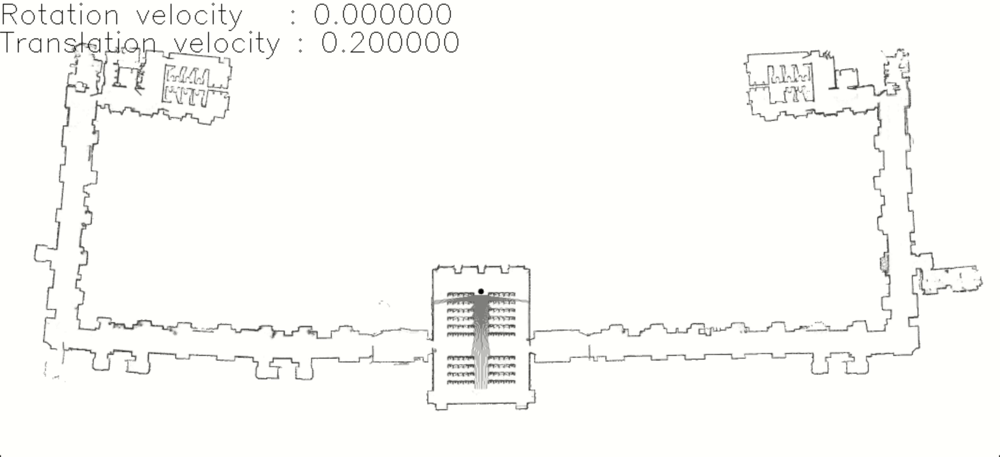

# RobotProgramming
### Project by Giulio Fedeli - fedeli.1873677@studenti.uniroma.it 

This project is part of the Robot Programming course in the context of the  AI & Robotics Master's Degree at the University of Rome La Sapienza, Italy.<br>

The goal of the project is to implement a 2D laser robot system that allows for single or multidevice configurations. Secondary devices are mounted on the parent one with a relative frame system. All is integrated through ROS.<br>

The project is run on ros1 noetic on Ubuntu 20.04<br>

<p align="center">
	
</p>

## Build the directory
Before building make sure roscore is running in a separate terminal:
```sh
source /opt/ros/noetic/setup.sh

roscore
```

To build the project a build.sh script is inlcuded in the main folder:
```sh
. build.sh
```